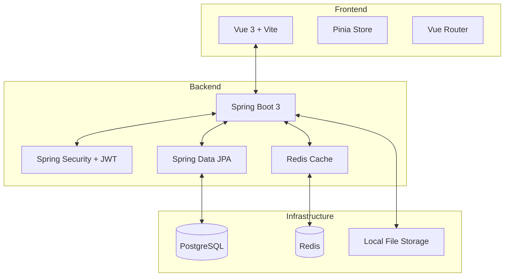

# PostZen - Medium-Mini Blogging Platform

A production-style blogging platform built with **Spring Boot 3** and **Vue 3**.

## 🏗️ Architecture



## 🚀 Tech Stack

### Backend
- **Framework:** Spring Boot 3.2.2
- **Language:** Java 17
- **Security:** Spring Security, JWT (Access + Refresh Tokens)
- **Database:** PostgreSQL (Persistence), Redis (Caching & Token Blacklisting)
- **API Docs:** Swagger UI / OpenAPI 3
- **Extras:** Lombok, Jakarta Validation, Spring Mail

### Frontend
- **Framework:** Vue 3 (Composition API)
- **Build Tool:** Vite
- **Styling:** Tailwind CSS
- **State Management:** Pinia
- **Routing:** Vue Router (with Auth Guards)
- **Markdown:** Marked + DOMPurify
- **HTTP Client:** Axios (with Interceptors)

---

## 🛠️ Getting Started

### Prerequisites
- Docker & Docker Compose
- JDK 17+
- Node.js 18+

### 1. Infrastructure Setup
```bash
docker compose up -d
```
Starts PostgreSQL and Redis containers.

### 2. Backend Setup
```bash
cd backend
./mvnw spring-boot:run
```
The API will be available at `http://localhost:8080`.

### 3. Frontend Setup
```bash
cd frontend
npm install
npm run dev
```
The application will be available at `http://localhost:5173`.

---

## 📖 Key Features
- **Modern UI**: Clean, responsive design built with Tailwind CSS.
- **Security**: Robust JWT-based authentication with auto-refreshing tokens.
- **Rich Editor**: Markdown-based writing experience with live preview and image uploads.
- **Performance**: Cache-aside strategy using Redis for fast post retrieval.
- **Engagement**: Paginated comment system.
- **Control**: Role-based access (USER, ADMIN) and scheduled post publishing.

## 📄 Documentation
- [Example API Requests](API_EXAMPLES.md)
- [Implementation Walkthrough](.gemini/antigravity/brain/af6a256d-0916-4e2f-b482-c5b6b3d72c06/walkthrough.md)
